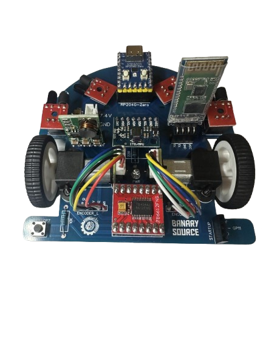

# Micromouse RP2040 Zero

Este repositorio contiene los códigos de prueba para verificar el correcto funcionamiento de los periféricos integrados en un robot tipo **Micromouse** basado en el microcontrolador **RP2040 Zero**.

  

## 🎯 Objetivo

Facilitar a los usuarios con el mismo prototipo la validación de hardware antes de programar rutinas de navegación, control de trayectoria o resolución de laberintos.

---

## 🧩 Perifericos probados

| Componente         | Descripción                                      |
|--------------------|--------------------------------------------------|
| 🟢 RP2040 Zero     | Microcontrolador principal                      |
| 🔵 LED RGB (Neopixel) | LED direccionable en GP16                    |
| 🔘 Push Button     | Botón de inicio conectado a GP8                  |
| ⚙️ Motores DC      | 2 motores con control PWM + dirección (Puente H) |
| 🔄 Encoders        | Encoders de cuadratura con detección de dirección |
| 🎯 MPU6050         | Acelerómetro y giroscopio vía I2C               |
| 📶 Bluetooth HC-06 | Comunicación UART con comandos por BT           |

---

## ⚙️ Requisitos
Arduino IDE (o equivalente compatible)

### Librerías:
- Adafruit_NeoPixel
- MPU6050_light
- SoftwareSerial (si se usa Bluetooth con UART por software)
Cable USB-C
Módulo Bluetooth HC-06 emparejado a 9600 baudios

## 🧪 Pruebas por componente
En esta sección encontrarás ejemplos para verificar el correcto funcionamiento de cada uno de los periféricos del robot Micromouse RP2040 Zero. Puedes cargar estos códigos desde Arduino IDE para probar por separado cada módulo.

| Componente                 | Descripción                                      | Enlace al código                                                 |
| -------------------------- | ------------------------------------------------ | ---------------------------------------------------------------- |
| 🟢 **LED RGB (Neopixel)**  | Prueba básica para encender el LED RGB integrado | [`examples/01_RGB`](examples/01_RGB/01_RGB.ino)                      |
| 🔘 **Botón de inicio**     | Lectura del botón para encender el RGB integrado | [`examples/02_PushButton`](examples/02_PushButton/02_PushButton.ino) |
| ⚙️ **Motores y puente H**  | Control de velocidad y dirección con PWM         | [`examples/03_Motors`](examples/03_Motors/03_Motors.ino)             |
| 📈 **Sensores analógicos** | Lectura ordenada de sensores conectados a ADC    | [`examples/04_Sensors`](examples/04_Sensors/04_Sensors.ino)          |
| 🔄 **Encoders de motores** | Conteo de pulsos y detección de dirección        | [`examples/05_Encoders`](examples/05_Encoders/05_Encoders.ino)       |
| 🧭 **MPU6050** (I2C)       | Configuracion y uso del MPU6050                  | [`examples/06_MPU`](examples/06_MPU/06_MPU.ino)                      |
| 📶 **Bluetooth (HC-06)**   | Control del LED RGB mediante comandos Bluetooth  | [`examples/07_Bluetooth`](examples/07_Bluetooth/07_Bluetooth.ino)    |
| 📶 **MPU6050 (Adafruit)**  | Configuracion y uso del MPU6050 (Librería Adafruit)  | [`examples/08_MPU6050`](examples/08_MPU6050/08_MPU6050.ino)      |

> ⚙️ Para compilar los ejemplos asegúrate de tener configurado tu entorno siguiendo la guía:
[`Configuración Arduino para RP2040`](docs/Arduino_RP2040_Configuration.md)

## 🚀 Cómo usar
- Conecta tu RP2040 Zero por USB al PC.
- Abre uno de los archivos .ino según el periférico que desees probar.
- Carga el sketch desde el Arduino IDE.
- Sigue las instrucciones del monitor serial o desde la app Bluetooth.

## 📲 Comandos vía Bluetooth
En la prueba de RGB por Bluetooth, puedes enviar desde el celular los siguientes caracteres:
| Comando | Acción    | Color del LED |
| ------- | --------- | ------------- |
| `F`     | Adelante  | Verde         |
| `B`     | Atrás     | Rojo          |
| `R`     | Derecha   | Azul          |
| `L`     | Izquierda | Amarillo      |
| `S`     | Stop      | Blanco        |

## 📌 Notas
El bus I2C fue remapeado a los pines GP10 (SDA) y GP11 (SCL).
El puerto UART0 fue utilizado para comunicación Bluetooth mediante SoftwareSerial.
Se recomienda utilizar una fuente externa si se conectan motores directamente.

## 🤝 Contribución
Si tienes un robot basado en este diseño y deseas mejorar las pruebas o agregar nuevas funciones, ¡las pull requests son bienvenidas!

## 🔖 Licencia
Este proyecto está bajo licencia MIT. Puedes usarlo, modificarlo y distribuirlo libremente.

---

## **📌 Autor:**  
🎓 **Eric G, Vallejo**  
💼 *Docente e integrador de proyectos en:*  
🔹 Robótica  
🔹 Automatización industrial  
🔹 Sistemas embebidos y programación

